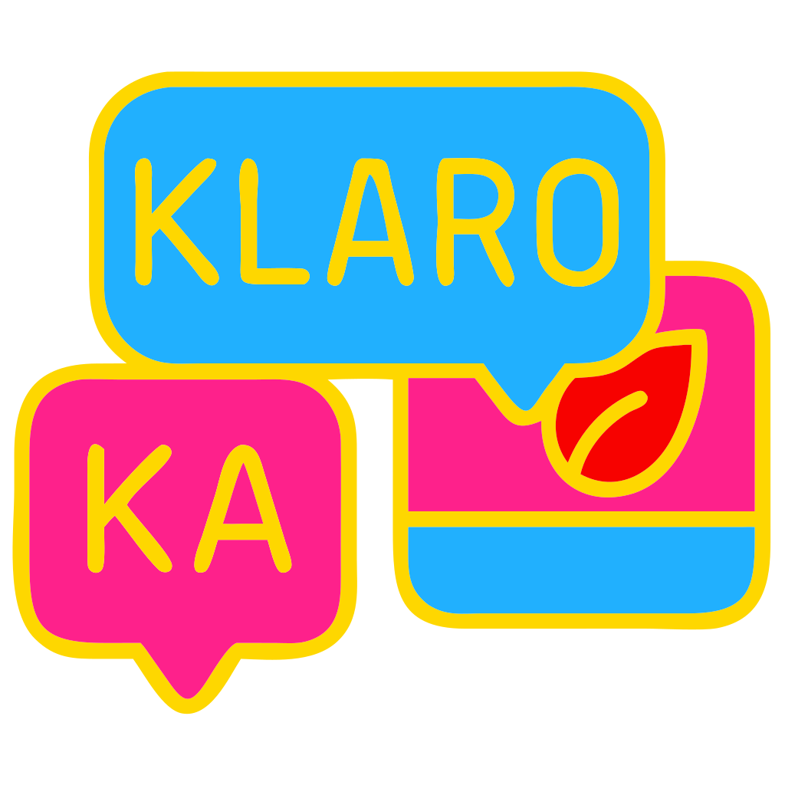

<div align="center">
  
  
  # Klaro
  
  **Simple and fast translation app for KDE Plasma**
  
  A native KDE application for quick and easy text translation
  
</div>

---

## About

Klaro is a native KDE application that provides quick and easy text translation with a simple and intuitive interface. Built specifically for the KDE Plasma desktop environment, it integrates seamlessly with your workflow.

### Features

- **Fast translation** - Get instant translations with minimal clicks
- **Simple interface** - Clean and intuitive design built with Kirigami
- **Native KDE integration** - Built with Qt/QML for seamless Plasma desktop experience
- **Lightweight** - Minimal resource usage for quick translations

## Installation

### Flathub (Recommended)

The easiest way to install Klaro is through Flathub:

[](https://flathub.org/apps/io.github.denysmb.klaro)

Or via command line:
```bash
flatpak install flathub io.github.denysmb.klaro
```

### Building from Source

For build instructions, see [BUILD.md](BUILD.md).

## Screenshot


## License

This project is licensed under the GPL-3.0 License - see the LICENSE file for details.
